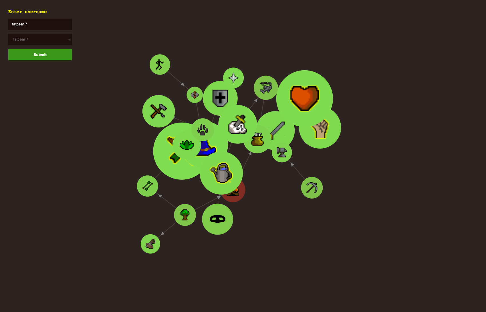
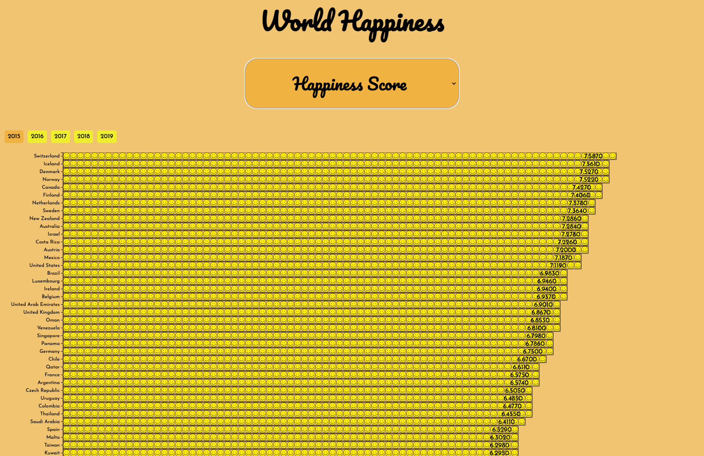
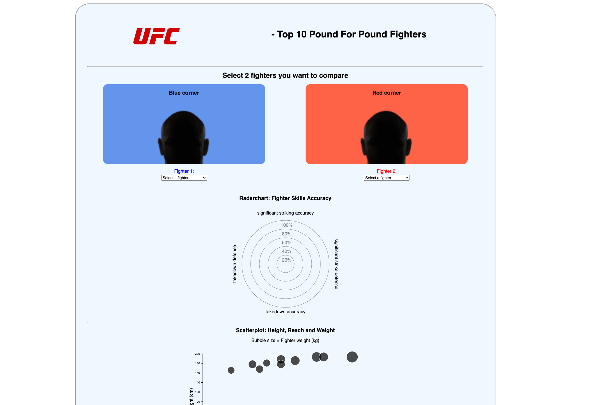

# Voorbeelden

De afgelopen jaren zijn er tijdens de tech-track al veel mooie interactieve visualisaties gemaakt. Ook is er inspiratie gehaald uit andere websites en zijn er een paar goede startpunten om te zoeken naar datasets.

## Studentenwerk

Hier een aantal voorbeelden van studentenwerk van afgelopen jaar:

<table>
  <tr valign="top">
    <td width="25%"><a href="https://github.com/briannededeugd"><strong>@briannededeugd</strong></a> - <em>"Female Representation in Cinema", an interactive data visualisation telling the story of women in film during the past 100 years. </em>Vooral goed omdat de structuur van de componenten in Svelte goed in elkaar zat.</td>
  <tr valign="top">
    <td width="25%"><a href="#"><strong>@Stephan Sierra Perdomo</strong></a> - <em>Old School RuneScape account visualization. You can type any account and you will see every single skill in the game represented as a node.</em> Vooral goed vanwege het speelse ontwerp en de data handling.  </td>
  </tr>
    <tr valign="top">
    <td width="25%"><a href="https://github.com/DonnaBaijens/"><strong>@Donna Baijens</strong></a> - <em>The World Happiness data visualisation is about Happiness. It's about which countries in the world are the happiest. This concerns five years (2015, 2016, 2017, 2018, 2019) and therefore five datasets.</em> Donna heeft zonder veel voorkennis van code toch een goed werkende visualizatie weten te maken.  </td>
  </tr>
    <tr valign="top">
    <td width="25%"><a href="https://github.com/EmreT58"><strong>@Emre Taşköprü</strong></a> - <em>Een UFC fighter comparison website waarbij je 2 fighters uit de UFC top 10 Pound for Pound fighters kan selecteren om statistieken door middel van datavisualisaties met elkaar te vergelijken.</em> </td>
  </tr>
</table>

## Inspiratie

Hier een aantal voorbeelden van interactieve visualisaties:

* [Pudding.cool](https://pudding.cool/) - is een digitaal publicatie platform dat interactieve visuele essays maakt en custom infographics.
* [Our World in Data](https://ourworldindata.org/) - is een non-profit organisatie die onderzoek doet naar de wereld en die kennis weergeeft in interactieve visualisaties.
* [WJS Graphics](https://graphics.wsj.com/) - journalistieke platforms gebruiken vaak interactieve visualisaties bij hun artikelen. The Wall Street Journal maar ook dichter bij huis zoals bijv. [Follow the Money](https://www.ftm.nl/artikelen) of [NOS op 3](https://nos.nl/op3) (zie specials) doen dit veel.

## Datasets

Hier een aantal websites waar je kan beginnen met het zoeken naar relevante datasets. 

Er zijn veel 'public api' repositories, vaak diensten bedrijven of services die hun data aanbieden als API:

* https://rapidapi.com/
* https://publicapis.dev/
* https://github.com/public-apis/public-apis
* https://www.kaggle.com/

Je kan het ook wat dichter bij huis zoeken. Kijk bijvoorbeeld eens naar organisaties zoals overheden musea en gemeente:

* Gemeente: https://data.amsterdam.nl/
* Musea: http://data.rijksmuseum.nl/
* Overheid: https://data.gov/
